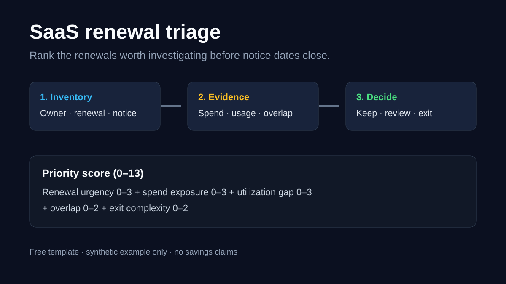

# SaaS renewal triage

A small, read-only worksheet for finance and operations teams that need to decide which software renewals deserve attention before cancellation notice dates close.

This is a prioritization aid, not a savings calculator. It does not claim that a flagged contract should be cancelled or that any saving is achievable.

## Use it in 20 minutes

1. Copy `renewal-triage-template.csv`.
2. Add only the renewals inside your review horizon, usually 90 days.
3. Record the owner, renewal date, notice deadline, annual spend, purchased seats, active seats, and known overlap.
4. Score each row using the rubric below.
5. Investigate the highest scores first. Keep the evidence and decision owner in the row.

Start with redacted or non-sensitive inventory data. Do not put contract text, employee names, credentials, invoice documents, or confidential usage logs in a public copy.

## Priority rubric

The score ranks review effort. It does not estimate savings.

| Factor | 0 | 1 | 2 | 3 |
| --- | --- | --- | --- | --- |
| Renewal urgency | More than 180 days | 91–180 days | 31–90 days | 30 days or less |
| Spend exposure | Set thresholds for your portfolio | Low | Medium | High |
| Utilization gap | No measured gap | Small or uncertain | Material | Severe or no usable owner |
| Overlap | None known | Possible | Confirmed | n/a |
| Exit complexity | Low | Medium | High | n/a |

`priority_score = renewal urgency + spend exposure + utilization gap + overlap + exit complexity` (maximum 13).

Set spend thresholds before scoring so the ranking is consistent. A high score means “review now,” not “cancel.”

## Decision evidence to collect

- named business owner and current use case
- active-seat evidence and measurement window
- renewal and notice dates confirmed from an authorized source
- known functional overlap and whether migration is realistic
- cancellation, downgrade, or seat-reduction constraints
- the person accountable for the decision and a review date

The included example is synthetic and clearly labelled.

## Fixed-scope diagnostic hypothesis

For a team with renewals due inside 90 days:

- **Price:** USD 750 fixed
- **Scope:** up to 12 vendor renewals from one redacted inventory export
- **Output:** ranked triage table, evidence gaps, and a short decision memo
- **Timing:** five business days after receiving the agreed input
- **Review:** one 30-minute walkthrough and one revision
- **Exclusions:** negotiation, cancellation, implementation, contract interpretation, security review, savings guarantee, and production-system access

This is an unvalidated offer. No buyer has accepted this price or scope. The paid value would need to come from defensible prioritization and a decision-ready memo, not from the worksheet alone.

## Public test

Qualified feedback sought: finance, procurement, or operations practitioners who own software renewals. The useful reply is whether the fields are sufficient to choose what gets reviewed first, and what evidence is missing.

## Sources and context

- Tropic pricing and bundled service model: https://www.tropicapp.io/pricing
- A free public SaaS-management-template substitute: https://github.com/Cech1337/awesome-saas-management

These sources support category and substitute context only. They do not prove demand for this template or offer.
